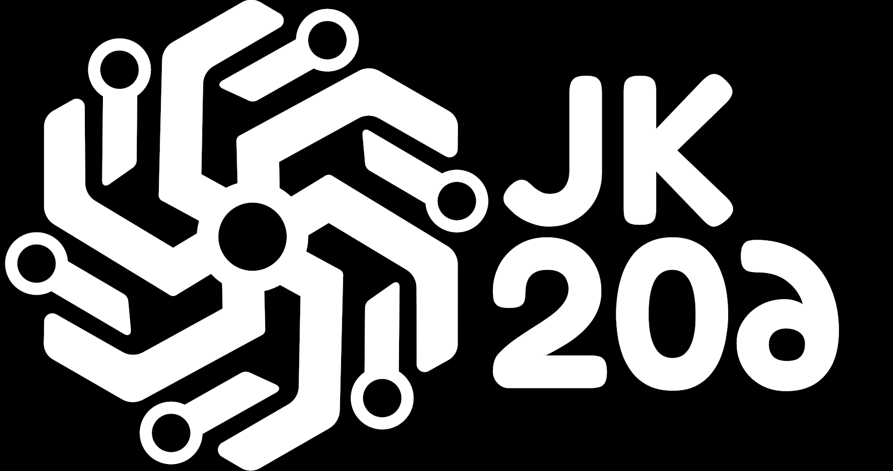

<h2 align="Left"> English </h2>

This project consists of a mechanical ortolinear keyboard design that is capable of being used for both a macropad and a 50% keyboard.

This is achieved through a modular design PCB that can be used by itself to mount a macropad with up to 20 keys (5 of them can be exchanged for encoders); while with three PCBs you can mount a keyboard with up to 60 keys (3 of them can be encoders)

The source code of the keyboard was written in CircuitPython using the KMK firmware, the microcontroller used is the Raspberry Pi Pico.

If you want to build your own JK206, go to the guide, where there will be the step-by-step to assemble and configure it

<strong>Note:</strong> If you just want to assemble your own JK206 and don't plan to modify anything of the PCB design, you don't need to touch the KiCAD files, directly use the Gerbers as the guide says

<h2 align="Left"> Español </h2>

Este proyecto consiste en un diseño de teclado mecánico ortolineal que es capaz de utilizarse tanto para un macropad como para un teclado 50%. 

Esto se consigue mediante una PCB de diseño modular que se puede usar por si misma para montar un macropad de hasta 20 teclas (5 de ellas se pueden cambiar por encoders); mientras que con tres PCBs se puede montar un teclado de hasta 60 teclas (3 de ellas pueden ser encoders)

El código fuente del teclado fue escrito en CircuitPython haciendo uso del firmware KMK, el microcontrolador utilizado es el Raspberry Pi Pico.

Si quieres armar tu propio JK206, entra en la guía, donde estará el paso a paso para ensamblarlo y configurarlo 

<strong>Nota:</strong> Si solo quieres montar tu propio JK206 y no piensan modificar nada del diseño de la PCB , no necesitas tocar los archivos de KiCAD, usa directamente los Gerbers como dice la guía

<h1 align="Left"> Photos / Fotos </h1>

These photos are from a prototype version of the project, the final version features some minor changes / Estas fotos son de una versión prototipo del proyecto, la versión final presenta algunos cambios menores

